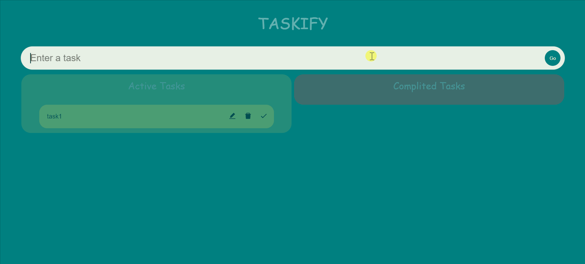
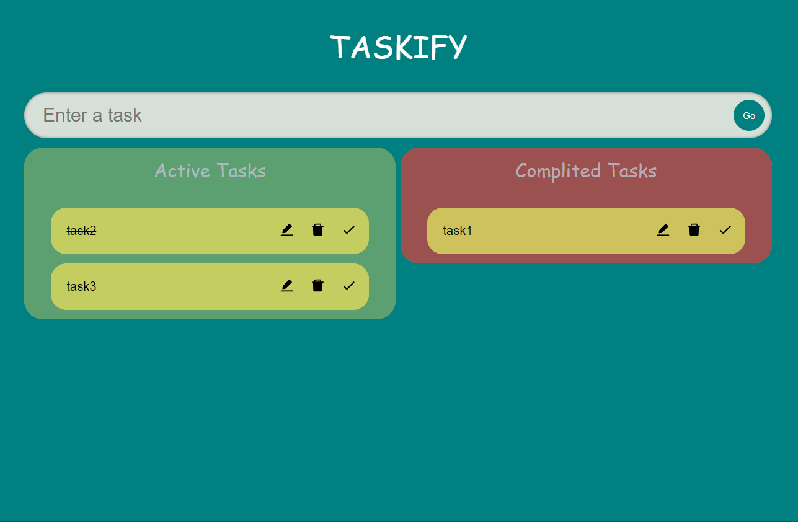

#  Task List Website  written in TS

## Quick Preview
 

## Demo Website -> [HERE](https://gosia-magdzik.github.io/To-do-List-TS/)

## Description

- Taskify is my first project written in <b>TypeScript</b>. It's a to-do list built with React 
- I utilized React hooks such as <i>useState, useRef, and useReducer </i> to manage the state and interactions within the app.
- Additionally, I've incorporated the <b>"react-beautiful-dnd"</b> library, which allows me to move tasks between the "Active Tasks" and "Completed Tasks" sections.
- Each task has icons on the left side that allow users to delete, edit, or mark tasks as completed.
-     Each task in the list is equipped with icons on the right side, allowing users to delete, edit, or mark tasks as completed.
- The project fully responsive ->  
- I made sure to implement stylish and visually appealing designs using Styled Components to enhance the overall look .

